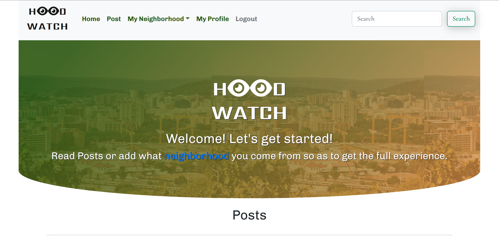

# HOOD WATCH

A  web application that allows you to be in the loop about everything happening in your neighborhood.

## Description

 
While there has been some progress towards gender equality and women empowerment, women are still not fully empowered in technology and leadership. Women are the change agents and champions of their communities. When empowered they can contribute to important development goals and to positive change which will in turn spur economic growth for Kenya and Africa. Starrs aims to bridge the gap by showcasing and broadcasting the inspiring, cool, creative and downright unusual of the Females in Tech space. 
 

<a href="https://neighborhoodwatchngiway.herokuapp.com/">Click to View</a>

 

# Collaborators
### <a href="https://github.com/waynemorphic">Wayne Kirimi </a>
### <a href="https://github.com/Ngina-G">Ngina Gitau</a>

 

## User stories
A user of the application should be able to:
<ul>
<li>Sign in with the application to start using.</li>
<li>Set up a profile about me and a general location and my neighborhood name.</li>
<li>Find a list of different businesses in my neighborhood.</li>
<li>Find Contact Information for the health department and Police authorities near my neighborhood.</li>
<li>Create Posts that will be visible to everyone in my neighborhood.</li>
<li>Change My neighborhood when I decide to move out.</li>
<li>Only view details of a single neighborhood.</li>
</ul>

## Technologies Used
Python3 (3.8.10)
Django 4.0.4
Bootstrap 5.2
powershell
unittest
SQL 
PostgreSQL
SQLAlchemy

### Setup Instructions and Installation
Fork or clone this repository to a location in your file system. git clone 
Open terminal command line then navigate to the root folder of the application.
Run ./start.sh

### Development
Want to contribute? Great!

To fix a bug or enhance an existing module, follow these steps:
<ul>
<li>Fork the repo</li>
<li>Create a new branch (git checkout -b improve-feature)</li>
<li>Make the appropriate changes in the files</li>
<li>Add changes to reflect the changes made</li>
<li>Commit your changes (git commit -am 'Improve feature')</li>
<li>Push to the branch (git push origin improve-feature)</li>
<li>Create a Pull Request</li>
</ul>

### Known bugs
If you find a bug, kindly open an issue here by including your search query and the expected result.

If you'd like to request a new function, feel free to do so by opening an issue here. Please include sample queries and their corresponding results.

### Contact Us
Visit my website [here](https://www.nginagitau.com/).
If you have any questions or comments, 
Contact me at:
  Nginagitau11@outlook.com
  kirimiwayne@gmail.com

### LICENSE 
MIT License

Copyright (c) 2022 Ngina

Permission is hereby granted, free of charge, to any person obtaining a copy
of this software and associated documentation files (the "Software"), to deal
in the Software without restriction, including without limitation the rights
to use, copy, modify, merge, publish, distribute, sublicense, and/or sell
copies of the Software, and to permit persons to whom the Software is
furnished to do so, subject to the following conditions:

The above copyright notice and this permission notice shall be included in all
copies or substantial portions of the Software.

THE SOFTWARE IS PROVIDED "AS IS", WITHOUT WARRANTY OF ANY KIND, EXPRESS OR
IMPLIED, INCLUDING BUT NOT LIMITED TO THE WARRANTIES OF MERCHANTABILITY,
FITNESS FOR A PARTICULAR PURPOSE AND NONINFRINGEMENT. IN NO EVENT SHALL THE
AUTHORS OR COPYRIGHT HOLDERS BE LIABLE FOR ANY CLAIM, DAMAGES OR OTHER
LIABILITY, WHETHER IN AN ACTION OF CONTRACT, TORT OR OTHERWISE, ARISING FROM,
OUT OF OR IN CONNECTION WITH THE SOFTWARE OR THE USE OR OTHER DEALINGS IN THE
SOFTWARE.

